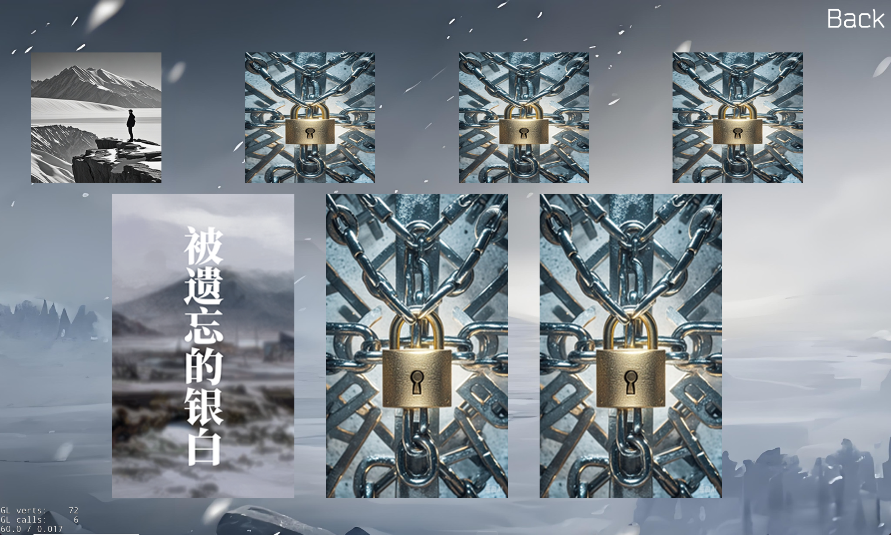

# 1. 项目简介

本项目是基于cocos2d-x引擎实现的塔防游戏……

# 2. 实现的功能及其实现方法

## 2.1 计时器

……

## 2.2 Buff

……

## 2.3 动画效果

……

## 2.4 存档

保存存档的功能主要是利用cocos2d-x引擎提供的UserDefault类，将游戏中的数据保存到本地文件中。 
具体实现方法如下：
```
// 保存存档
auto userDefault = UserDefault::getInstance();
// 两个参数分别是key和对应的value
userDefault->setBoolForKey("clearItemShow", false); // 设置布尔值
userDefault->setIntegerForKey("level1", 0); // 设置整数值
// 类似的，还有setStringForKey()、setFloatForKey()等方法
```
```
// 读取存档
auto userDefault = UserDefault::getInstance();
// 两个参数分别是key和如果未找到对应的value则返回的默认值
int level1Scene = userDefault->getIntegerForKey("level1", 0);
```
存档能够保证每次进入游戏时，关卡分数、关卡解锁和音量调整等都是上一次退出时的状态，提高了用户体验。
存档会在用户通关游戏关卡或者改变音量时自动保存，不需要用户手动保存，确保游戏存档数据及时更新。
此外，在游戏的Manual中的Setting界面，用户可以点击Clear Saved Data按钮来清除存档数据，重新开始游戏。这时游戏就会回到初始状态，关卡分数、关卡解锁和音量调整等都会被重置。
值得注意的是，在游玩关卡过程中，通过塔的查询按钮是可以进入Manual界面的，但此时Setting中只有音量调节选项，没有Clear Saved Data按钮，因为此时游戏还在进行中，不应该清除存档数据。

**展示如下：**
刚进游戏时，一切都是初始
{width=600}
游玩后，关卡分数、关卡解锁和音量调整等都会被保存，退出后再次进入游戏时游戏进度与退出前一致：
{width=600}
点击Clear Saved Data按钮后，存档数据被清除，游戏回到初始状态：
{width=600}
{width=600}

## 2.5 剧情

这个游戏的背景故事的灵感来源于游戏《原神》龙脊雪山地区的故事以及游戏《明日方舟》中萨米肉鸽的背景故事。在高中时期，我尝试基于龙脊雪山的故事创作了一篇小说，并且令人出乎意料的是，这篇小说获得了创新作文大赛的二等奖。而在这次这个剧情中，我对过去那篇小说进行了补充修改，并且加入了萨米肉鸽的剧情元素，使得这篇文章前后逻辑更加完整。

至于为什么会想到将萨米肉鸽元素和龙脊雪山剧情结合在一起，最主要的原因应该还是二者都具有冰雪的元素。而萨米肉鸽的剧情是关于科考队前往北方冰原探索的故事，龙脊雪山则是关于一个埋藏在冰雪中的遗迹的故事，因此自然而然地想到能否以探索为动机，以探索遗迹背后的故事为主体，同时，为了使得前后逻辑更加完整缜密，我将探索者与遗迹背后的故事相结合，从探索者的身份出发，尝试塑造一种神秘感、宿命感。之后，在组员的建议下，我加入了解谜元素，因为是在探索遗迹，解谜也是一件很正常、不突兀的事，同时，我将密文对照表作为彩蛋放在游戏中供玩家探索。

或许会有人问关卡与剧情是否相关，这自然是相关的，关卡的背景设计和怪物种类设计都是结合那一部分的剧情，分别对应了探索者从初到冰原、上山探索到最后决战的剧情。

## 2.6 待补充

……

# 3. 组员及分工

#### 朱博文

游戏项目的“主程”，搭建了游戏后端的底层逻辑，游戏中的各种基类主要由他编写，并在其他人存在技术问题时提供技术支持。在测试阶段主要由他使用调试器发现并解决游戏的各种bug。

#### 马楷恒

游戏项目的“主美”，承担了几乎所有的美术工作，包括素材选取、抠图、代码实现等。游戏中许多炫酷的粒子效果也由他基于cocos引擎实现的。

#### 李畅锦

游戏项目的UI框架设计师，负责页面切换，具体关卡的运行逻辑，存档、音量按钮功能的实现等，同时在测试阶段还参与了动画的优化。

#### 王晟宇

游戏项目的后端开发者及团队的协调者，负责具体敌人和塔的逻辑实现，同时游走在策划与游戏前后端负责人之间，协调策划的需求和代码的实现。在测试阶段从用户角度寻找游戏bug。

#### 朱善哲

游戏项目的“策划”，提供了游戏的背景设定，游戏运行结算的逻辑和各类敌人和塔的设定，同时还为游戏撰写剧情，完成图鉴部分。