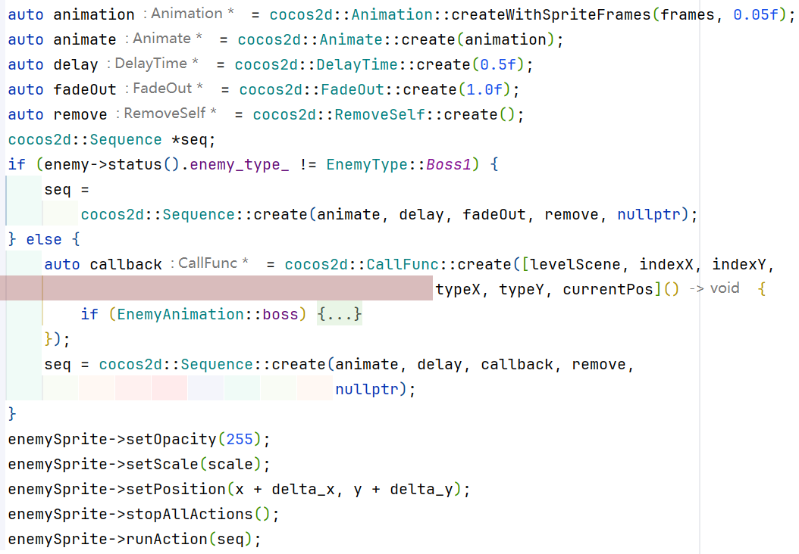

# 1. 项目简介

本项目是基于 cocos2d-x 引擎实现的塔防游戏。

# 2. 实现的功能及其实现方法

游戏分为前端的展示部分和后端的逻辑部分。

## 2.1 游戏逻辑

游戏逻辑全部实现于 `Classes/core` (cmake target: core) 中。

### Map

`Map` 类型封装了一局游戏的全部状态，包括地图、时钟、生命值、实体、`id` 分配器。地图在逻辑上是一个矩形，被分为若干个格子，每个格子中可为空、塔 (`Tower`) 或若干个敌人 (`Enemy`)，以类型 `Grid` 表示。此外 `GridRef` 类型代表了对地图中某一个的引用，为游戏中实体 (`Entity`) 访问上下文提供了便利的接口。

`Map` 向游戏的前端部分提供了一系列回调 (`Map::on_*`)，用于在特定事件发生时通知前端。

`Map` 提供了一系列接口，用于操作地图状态，如添加/移除塔和敌人。

特别的，`Map::update` 是游戏状态更新的入口点，其会更新时钟状态，然后依次更新地图每一格上 `Entity` 的状态，使敌人根据预设路线移动，最后结算攻击，移除死亡的 `Entity`。前端通过定时调用此方法驱动游戏进行。

### Entity

`Entity` 是对游戏中实体对象的抽象，其派生出 `Tower` 和 `Enemy` 两个虚基类分别抽象了塔和敌人两方。

每个 `Entity` 都有与之对应的唯一 `id` 作为标识。`id` 分配由 `Classes/core/id.h` 中的 `IdGenerator` 完成，每次通过自增生成一个不重复的 `id`。

`Entity` 定义了两个虚方法 `on_tick` 和 `on_death` 分别在时钟更新和死亡时被调用。

`Enemy` 额外定义了一个虚方法 `on_hit` 在被攻击时被调用。

此外，`*Mixin` 类型为 `Tower` 和 `Enemy` 提供了可选的额外状态和功能，如 buff、生命值等。

#### Buff

buff 功能由 `BuffMixin` 实现，其存储了一个实体当前的 `Buff`，并在更新时移除过期的 `Buff`，其提供了添加、移除 `buff` 和计算 `buff` 总效果的接口。

为了处理 `buff` 重复施加的问题，一个 buff 由 `BuffIdentifier` 和 `Buff` 构成，`Buff` 存储 `buff` 本身的信息，如种类。`BuffIdentifier` 由施加该 `buff` 的 `Entity` 的 `id` 和 `buff_id` 组成，其中 `buff_id` 表示该 `Entity` 对该 buff 的编号。由此，实现当同一个 `Entity` 多次施加同一个 buff 时，会重置该 buff 的时间而不会叠加效果。

---

在 `Classes/core/entity/tower` 和 `Classes/core/entity/enemy` 中分别是派生自 `Tower` 和 `Enemy` 的具体塔和敌人类型。这些类型各自可能存有自己的状态。

通过模版提供了相应的工厂 (`TowerFactory<T>` 和 `EnemyFactory<T>`)，实现构造函数的分派 (一些类需要额外的上下文进行构造而另一些不需要)和初始化。

---

### 时钟

游戏逻辑采用基于游戏刻 (tick) 进行计时，从而使各个事件的发生更加稳定。时钟实现在 `Classes/core/timer.h` 中，分为 `CLock` 和 `Timer` 两部分。`Clock` 存储时间状态，`Timer` 是无状态的，表示一个时间事件触发的条件。`Clock::is_triggered` 用于查询一个 `Timer` 对应的条件是否达到。

`CallbackTimer` 在此基础上实现了在达到 `Timer` 条件时调用回调的功能。


## 2.3 动画效果及音效

### 2.3.1 敌人动画

1. 敌人入场动画
   敌人经过 0.25s 的淡入效果的**同时**，开始正常按照预设路线移动。这是通过 cocos2d-x内置的动画接口实现的。

   

2. 敌人移动动画
   当后端逻辑中调用了 on_enemy_move 这个回调函数之后，会执行前端 EnemyAnimation 的 move 函数，它首先会判断下一格与当前格之间的曼哈顿距离是否超过 1，用于检测敌人是正常行走还是进行传送。
   如果是正常行走，则会通过敌人的类型获取到它的移动速度，根据移动速度的数值计算一格的距离应该被分成几份，将动作进行分解，每个分解动作会让敌人有个微小的位移，并更新敌人的帧动画。同时，也会判断敌人的前进方向，决定是否要将图片翻转。

   
   如果是传送，会转而执行 EnemyAnimation::transport 函数，它会根据移动速度计算动画时间，先后进行缩小、瞬移、放大的效果。
   

3. 敌人死亡动画
   在敌人血量归零之后，后端执行 on_enemy_death 回调，调用前端的 EnemyAnimation::dead 函数，函数中根据敌人的类型分类进行处理。
   如果是没有任何亡语的普通敌人，会直接通过 cocos2d-x 播放帧动画的接口，调用死亡动画，之后再播放淡出效果。
   如果是有亡语的普通敌人，即唯一的 Worm 对象，除了普通死亡动画之外，由于其还会降低其周围 8 格塔的攻击速度，死亡时不仅会在死亡位置释放一个淡蓝色光环的粒子效果，还会在受到减速效果的塔上放置一个雪花的标志，并在效果结束后消失。
   如果是处于一阶段的 Boss，由于会转成二阶段，需要单独处理，在播放完复活动画之后，在原地新创建一个 Boss2 对象，并将原来的对象析构。
   

4. 特殊敌人技能动画

   在后端执行 on_enemy_release_skill 的回调时，会执行 EnemyAnimation::releaseSkill 函数，针对不同敌人的技能进行处理：

   + 每隔一段时间降低周围塔的攻击力：播放敌人专属的释放技能动画，在此期间敌人不会移动，并在当前位置释放一个红色光环的粒子效果，在受到影响的塔上放置一个破损的剑作为标志，在效果结束后消失。播放专属音效。
   + 每隔一段时间恢复周围敌人的血量：没有专属动画，敌人继续保持移动，在释放技能时的位置释放一个绿色光环的粒子效果。
   + 自身周围的敌人移速提升：没有专属动画，敌人继续保持移动，在释放技能时的位置释放一个深蓝色光环的粒子效果。播放专属音效。
   + 无敌：在受到第一次攻击后自身透明度降低，在此期间仍然会移动，仍然会被塔锁定，效果结束后透明度恢复。
   + Boss1 技能：降低所有塔的攻击速度，并使所有塔无法释放技能，播放专属的释放技能动画，在此期间敌人不会移动，在所有塔上放置雪花标志和眩晕标志。
   + Boss2 技能：除了拥有 Boss1 所有的技能之外，还会拆除离自己最近的一个塔，同样会播放专属的释放技能动画，在此期间敌人不会移动。

5. 帧动画的制作及动画的补充说明
   敌人动画的绝大多数原始素材是 .webp 格式的，本项目首先将其转为 .mp4 格式，再转为 .gif 格式，通过 ps 软件将每一帧的背景扣成透明，并导出成一张张帧动画。
   由于在上述过程中不是所有敌人动画在图片中都是居中，在播放敌人死亡或技能动画时还添加了偏置值。

### 2.3.2 子弹动画

在后端执行 on_enemy_attacked 的回调时，会创建一个 Bullet 对象，通过判断塔的类型，决定是普通的 Bullet 对象还是其子类 MagicBullet。不管是哪一种，子弹都会自动跟踪敌人，在每一帧计算自身与敌人的夹角和 x, y 方向上的距离，通过夹角进行旋转，通过距离决定子弹的移动速度（距离越远，速度越快）。


+ Bullet 对象
  在击中敌人之后在敌人身上释放出血的粒子动画
+ MagicBullet 对象
  在移动过程中还会播放移动的帧动画，击中敌人后原地释放爆炸动画

### 2.3.4 塔技能动画

在后端执行 on_tower_release_skill 的回调时，会执行 TowerAnimation::releaseSkill 函数，根据塔的类型，分类处理动画：

+ 简单地提升自身属性：在塔上放置一个透明的绿色光罩动画，效果结束后消失。
+ 下一次攻击有特殊效果：Bullet 为导弹爆炸动画；MagicBullet 为放大击中后的爆炸效果。并播放爆炸音效。
+ 在塔周围释放效果：在作用的每个格子上播放相应的粒子动画，具体有爆炸（有专属音效）、减速、减抗、燃烧等效果，效果结束后消失。
+ 提升周围塔的攻击力：在作用的塔上放置一把剑的标志，自身位置放置一个透明的绿色光罩动画，效果结束后消失。

### 2.3.5 其他粒子效果

1. 在点击鼠标时，会在点击位置播放一个小型的提示粒子效果。
2. 剧情界面放置的彩蛋通过点击一个粒子效果的部位触发。

### 2.3.6 其他音效

在以下场景中，也会播放音效：塔升级、敌人进点、游戏结束（胜利或失败）。

> 注：音乐和音效的音量可以在图鉴界面调整

## 2.4 存档

保存存档的功能主要是利用cocos2d-x引擎提供的UserDefault类，将游戏中的数据保存到本地文件中。 
具体实现方法如下：
```
// 保存存档
auto userDefault = UserDefault::getInstance();
// 两个参数分别是key和对应的value
userDefault->setBoolForKey("clearItemShow", false); // 设置布尔值
userDefault->setIntegerForKey("level1", 0); // 设置整数值
// 类似的，还有setStringForKey()、setFloatForKey()等方法
```
```
// 读取存档
auto userDefault = UserDefault::getInstance();
// 两个参数分别是key和如果未找到对应的value则返回的默认值
int level1Scene = userDefault->getIntegerForKey("level1", 0);
```
存档能够保证每次进入游戏时，关卡分数、关卡解锁和音量调整等都是上一次退出时的状态，提高了用户体验。
存档会在用户通关游戏关卡或者改变音量时自动保存，不需要用户手动保存，确保游戏存档数据及时更新。
此外，在游戏的Manual中的Setting界面，用户可以点击Clear Saved Data按钮来清除存档数据，重新开始游戏。这时游戏就会回到初始状态，关卡分数、关卡解锁和音量调整等都会被重置。
值得注意的是，在游玩关卡过程中，通过塔的查询按钮是可以进入Manual界面的，但此时Setting中只有音量调节选项，没有Clear Saved Data按钮，因为此时游戏还在进行中，不应该清除存档数据。

**展示如下：**
刚进游戏时，一切都是初始
{width=600}
游玩后，关卡分数、关卡解锁和音量调整等都会被保存，退出后再次进入游戏时游戏进度与退出前一致：
{width=600}
点击Clear Saved Data按钮后，存档数据被清除，游戏回到初始状态：
{width=600}
{width=600}

## 2.5 剧情

这个游戏的背景故事的灵感来源于游戏《原神》龙脊雪山地区的故事以及游戏《明日方舟》中萨米肉鸽的背景故事。在高中时期，我尝试基于龙脊雪山的故事创作了一篇小说，并且令人出乎意料的是，这篇小说获得了创新作文大赛的二等奖。而在这次这个剧情中，我对过去那篇小说进行了补充修改，并且加入了萨米肉鸽的剧情元素，使得这篇文章前后逻辑更加完整。

至于为什么会想到将萨米肉鸽元素和龙脊雪山剧情结合在一起，最主要的原因应该还是二者都具有冰雪的元素。而萨米肉鸽的剧情是关于科考队前往北方冰原探索的故事，龙脊雪山则是关于一个埋藏在冰雪中的遗迹的故事，因此自然而然地想到能否以探索为动机，以探索遗迹背后的故事为主体，同时，为了使得前后逻辑更加完整缜密，我将探索者与遗迹背后的故事相结合，从探索者的身份出发，尝试塑造一种神秘感、宿命感。之后，在组员的建议下，我加入了解谜元素，因为是在探索遗迹，解谜也是一件很正常、不突兀的事，同时，我将密文对照表作为彩蛋放在游戏中供玩家探索。

或许会有人问关卡与剧情是否相关，这自然是相关的，关卡的背景设计和怪物种类设计都是结合那一部分的剧情，分别对应了探索者从初到冰原、上山探索到最后决战的剧情。

## 2.6 项目管理

项目使用 git 进行版本控制，大多数更改在各自分支上开发，通过 pull request 进行 code review 后合入主分支。

项目使用 github-actions 实现 CI 功能。每次 push 和 pull request 是会编译当前代码并上传构建结果，防止有编译问题的代码合入主分支影响开发。此外，还有一个手动触发的 action 用于 release 构建。

项目使用 cmake 作为构建系统。

项目主要支持的平台是 windows，但由于有成员使用 linux 开发，故也可在 linux 上运行。项目带有一个 nix flake 实现 linux 上的可复现构建，使用 `nix run github:IgnorantCopy/TowerDefence#tower-defence` 即可运行。

# 3. 组员及分工

#### 朱博文

游戏项目的“主程”，搭建了游戏后端的底层逻辑，游戏中的各种基类主要由他编写，并在其他人存在技术问题时提供技术支持。在测试阶段主要由他使用调试器发现并解决游戏的各种bug。

#### 马楷恒

游戏项目的“主美”，承担了几乎所有的美术工作，包括素材选取、抠图、代码实现等。游戏中许多炫酷的粒子效果也由他基于cocos引擎实现的。游戏发布后的介绍视频也主要由他剪辑制作。

#### 李畅锦

游戏项目的UI框架设计师，负责页面切换，具体关卡的运行逻辑，存档、音量按钮功能的实现等，同时在测试阶段还参与了动画的优化。

#### 王晟宇

游戏项目的后端开发者及团队的协调者，负责具体敌人和塔的逻辑实现，同时游走在策划与游戏前后端负责人之间，协调策划的需求和代码的实现。在测试阶段从用户角度寻找游戏bug。

#### 朱善哲

游戏项目的“策划”，提供了游戏的背景设定，游戏运行结算的逻辑和各类敌人和塔的设定，同时还为游戏撰写剧情，完成图鉴部分。